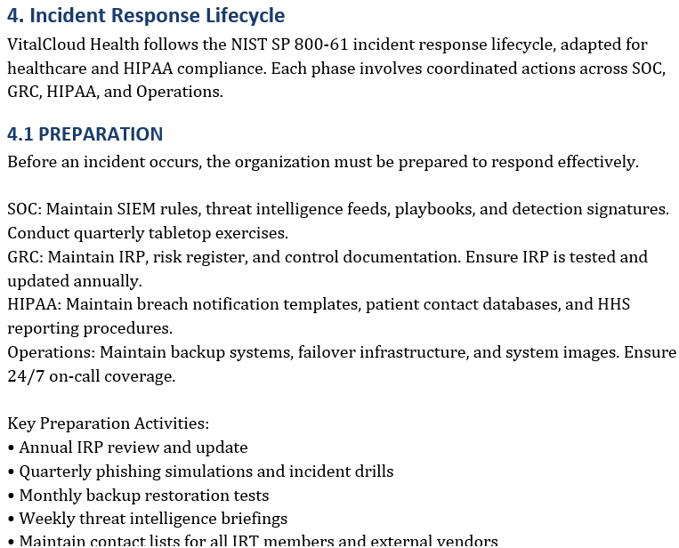
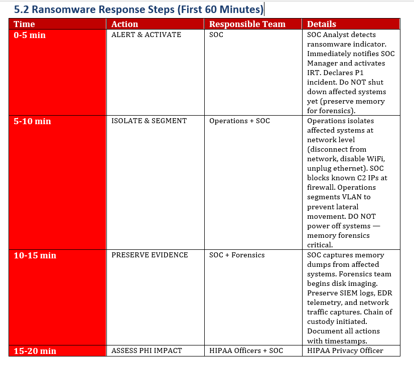
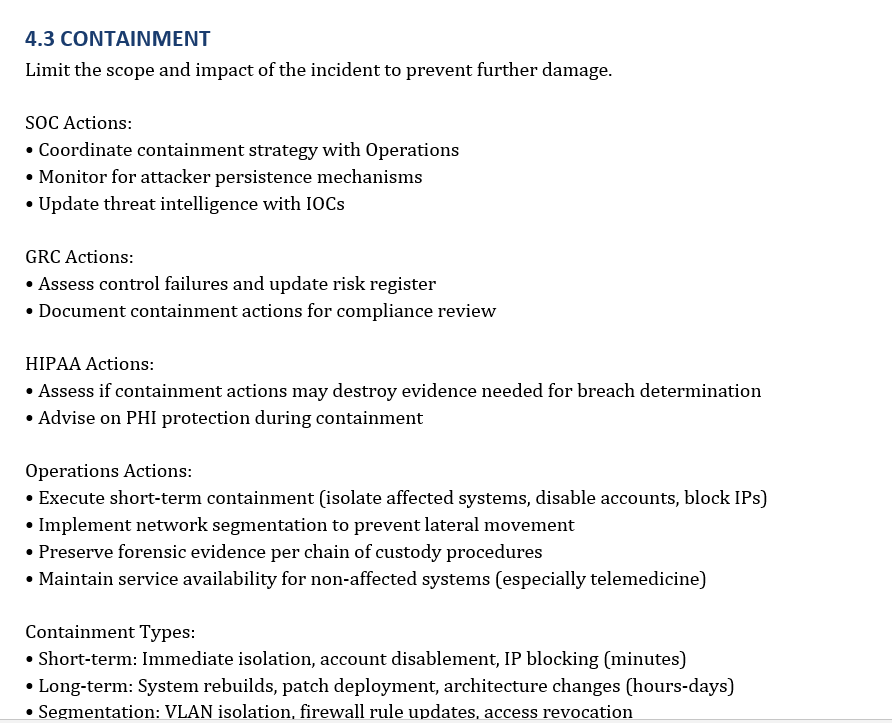
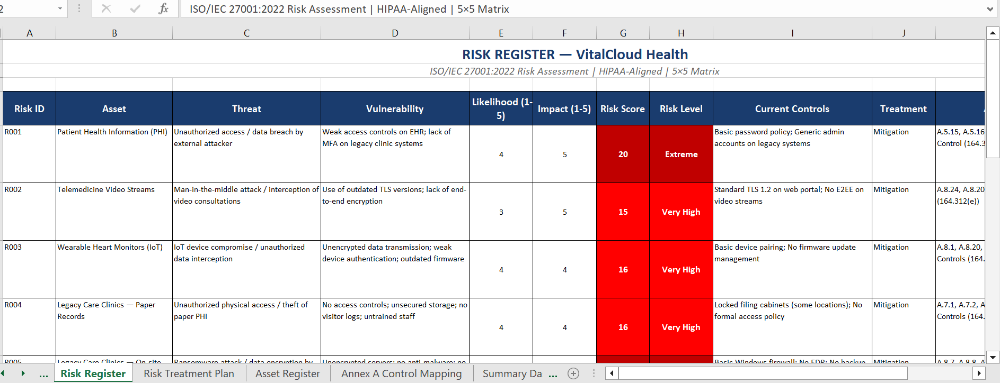
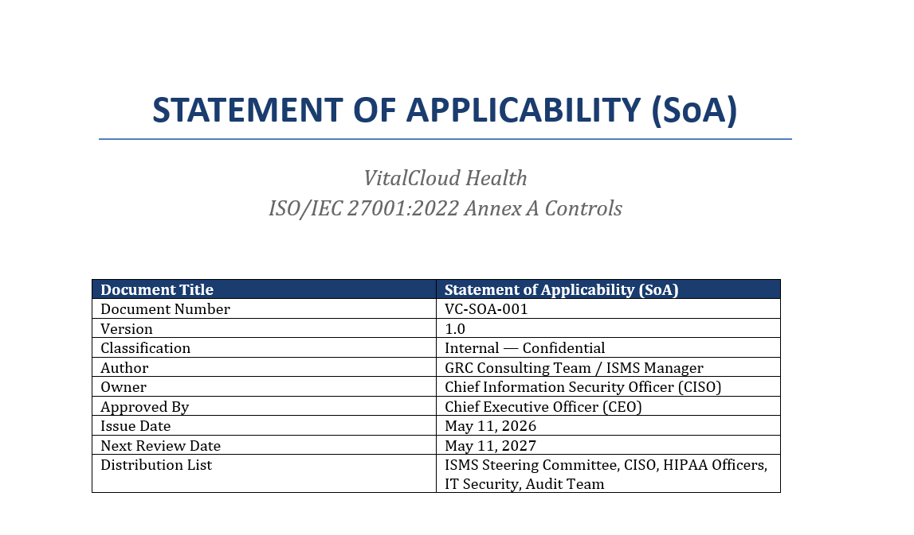
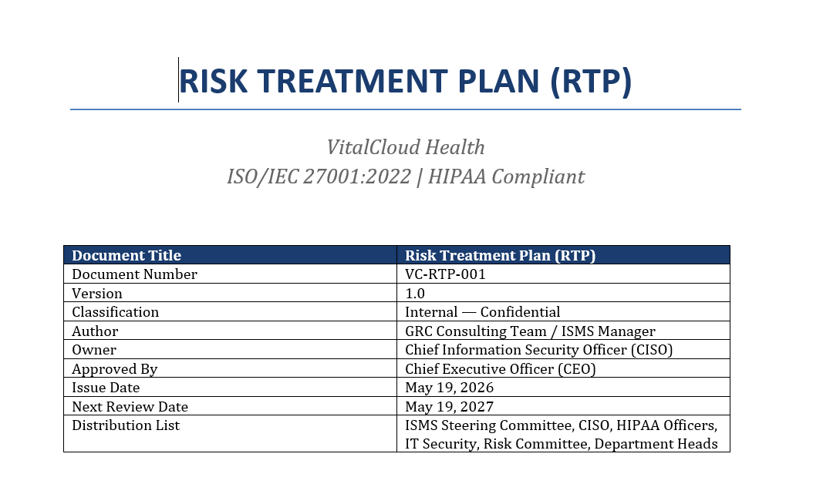

# VitalCloud Health — ISO 27001 & HIPAA GRC Implementation

Enterprise healthcare Governance, Risk, and Compliance (GRC) implementation project aligned with ISO/IEC 27001:2022 and HIPAA Security Rule requirements.

This project simulates the implementation of an enterprise Information Security Management System (ISMS) for a rapidly growing telehealth provider following the acquisition of legacy healthcare clinics with outdated infrastructure and security controls.

---

# Project Overview

VitalCloud Health is a simulated telehealth organization providing healthcare services to rural patients through mobile applications and web-based telemedicine platforms.

Following the acquisition of Legacy Care Clinics, the organization inherited multiple cybersecurity and compliance risks including:

- Unencrypted on-premise servers
- Paper-based PHI records
- Legacy imaging systems
- Weak access controls
- Outdated infrastructure
- Insufficient staff security awareness
- Third-party and vendor security risks

The organization required:
- ISO 27001:2022 certification readiness
- HIPAA compliance alignment
- Enterprise risk management
- Incident response capability
- SOC-integrated monitoring and security operations

within a 12-month implementation timeline.

---

# Objectives

- Implement an ISO 27001:2022-aligned ISMS
- Develop enterprise healthcare security governance documentation
- Conduct healthcare-focused risk assessments
- Build a Risk Treatment Plan (RTP)
- Develop HIPAA-aligned security controls
- Create SOC-oriented incident response procedures
- Simulate enterprise healthcare cybersecurity operations

---

# Frameworks & Standards

- ISO/IEC 27001:2022
- HIPAA Security Rule
- HITECH Act
- NIST SP 800-61 Rev.2
- NIST SP 800-30 Rev.1
- NIST SP 800-88
- RBAC (Role-Based Access Control)
- SIEM Monitoring Concepts
- Endpoint Detection & Response (EDR)
- Data Loss Prevention (DLP)
- Business Continuity & Disaster Recovery

---

# Repository Structure

```text
VitalCloud-GRC-ISO27001-HIPAA
│
├── Assets
├── ISMS
├── Incident_Response
├── Policies
├── Risk_Management
├── Screenshots
├── LICENSE
└── README.md
```

---

# Key Deliverables

## ISMS
- ISO 27001:2022-aligned Information Security Management System documentation

## Policies
- Enterprise Information Security Policy
- HIPAA-aligned governance controls

## Risk Management
- Healthcare Risk Assessment Report
- Statement of Applicability (SoA)
- Risk Treatment Plan (RTP)

## Incident Response
- Enterprise Incident Response Plan
- Ransomware response procedures
- Evidence handling workflows
- PHI breach escalation process

---

# SOC & Security Operations Relevance

This project demonstrates how enterprise governance and compliance frameworks integrate with Security Operations Center (SOC) functions in a healthcare environment.

Included operational security concepts:
- SIEM monitoring workflows
- Threat detection processes
- Incident triage and escalation
- Ransomware response procedures
- PHI breach handling
- Logging and monitoring controls
- Evidence preservation and chain of custody
- Security operations coordination
- Risk treatment and continuous monitoring

---

# Screenshots

## Incident Response Lifecycle



---

## Ransomware Response Playbook



---

## Containment Procedures



---

## Risk Assessment Matrix



---

## Statement of Applicability



---

## Risk Treatment Plan



---

# Architecture & Workflow Documentation

Additional supporting architecture and workflow documentation is available in the Assets directory.

---

# Disclaimer

This repository was developed as a simulated enterprise healthcare cybersecurity governance project for educational and portfolio purposes.

No real patient data, healthcare records, or organizational systems are included.

---

# Author

Daniel Nwachukwu

Cybersecurity | SOC Operations | Incident Response | Governance & Risk Management
